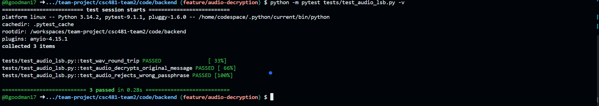
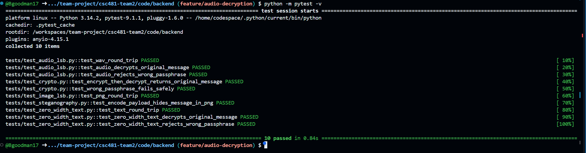
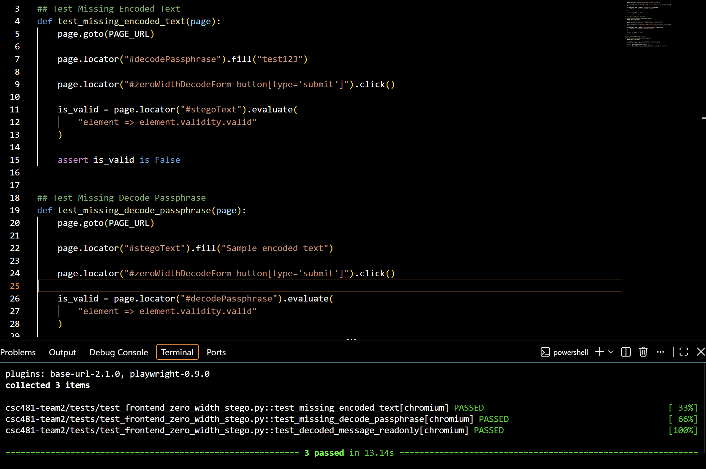
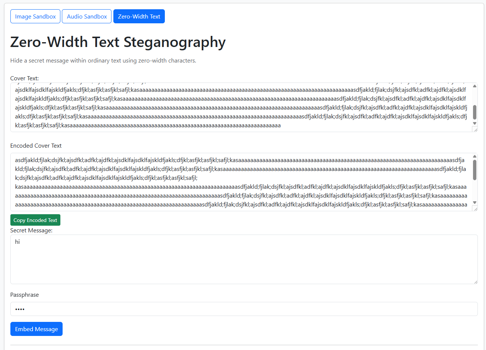
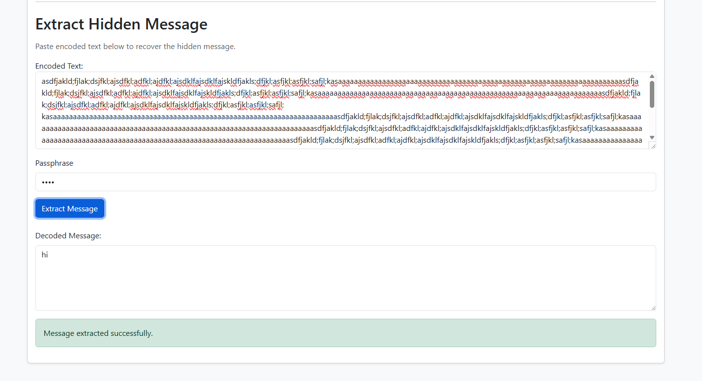

# Team 2 Week 8 Progress Report

## Comprehensive Web-Based Steganography Sandbox 

**Team:** Bryan Goodman, Kendra Pelzer, Jamaal Spratley
#
**Reporting period:** Week 8
## 1. Milestones achieved
- Completion of script editing for audio to ensure communication with the frontend for decryption. 100% passed with no errors achieved. 

## 2. Subtasks completed
| Subtask | Owner | Completed work |
| --- | --- | --- |
| Team Leader | Jamaal Spratley | Implemented zero-width text into the app and ran the first test for encoding and now decoding |
| Member A (Backend) | Bryan Goodman | Ensured the zero-width steganography communicates with the main branch. Completed Pytest for zero-width steganography and make sure there are no warnings. |
| Member B (Frontend/QA) | Kendra Pelzer | Developed the zero-width decryption frontend interface and created automated frontend tests to validate required encoded-text and passphrase inputs and the read-only decoded-message output field. |

## 3. Test evidence

### 3.1 Bryan

**Purpose:** To ensure the backend decryption communicates with the frontend. 

**Expected Result:** Completion of both pytests for test_audio_lsb.py and audio_lsb.py. If there are any errors, they are to be corrected to ensure communication. 

**Result:** Both pytest passed with 100% completion and no errors to report. 

**Completed Pytest**

*Image 1: Completion of test_aduio.lsb.py with no errors or warnings. 100% passed. 

*Image 2: Completion of audio_lsb.py with no errors or warnings. 100% passed. 

#
### 3.2 Frontend Zero-Width Decryption - Kendra

**Frontend Tests:**
Validate the newly developed zero-width decryption frontend interface and ensure required user inputs and the decoded-message output field behave as expected.

**Expected result:**
The frontend should reject submissions when encoded text or the decryption passphrase is missing, and the decoded-message output field should be present and read-only.

**Result:** 
PASS. All three automated frontend tests passed. The tests confirmed validation for missing encoded text, validation for a missing decryption passphrase, and that the decoded-message output field is present and read-only.

*Image 3: Zero-width text decryption frontend with encoded-text input, passphrase field, Extract Message button, and decoded-message output.d

#
### 3.3 Jamaal

**Purpose:** Add a decryption path to app.py so the zero-width text can be extracted.

**Expected result:** The  secret message should be imported and extracted 

**Result:** The  secret message was extracted correctly 

## 4. Lessons learned

- 

## 5. Progress against the plan

The Week 8 the plan required 

The Week 8 will focus on working towards the decryption of Image.
