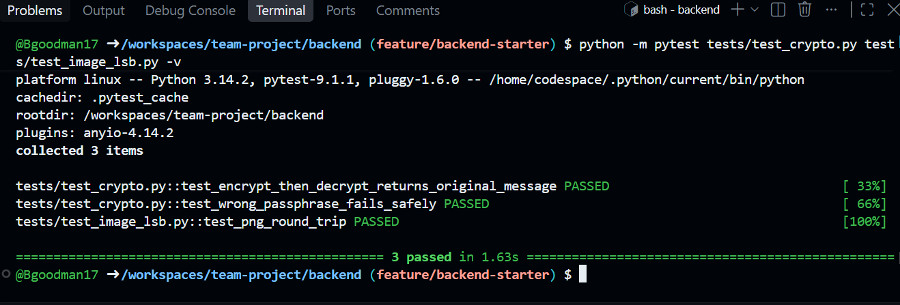
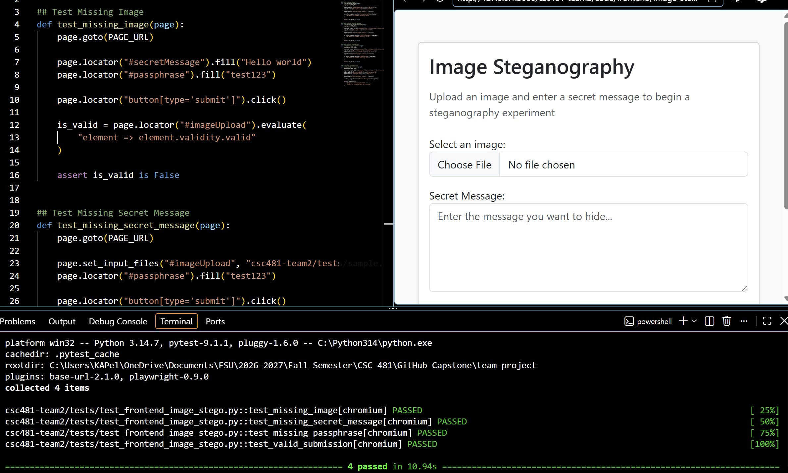
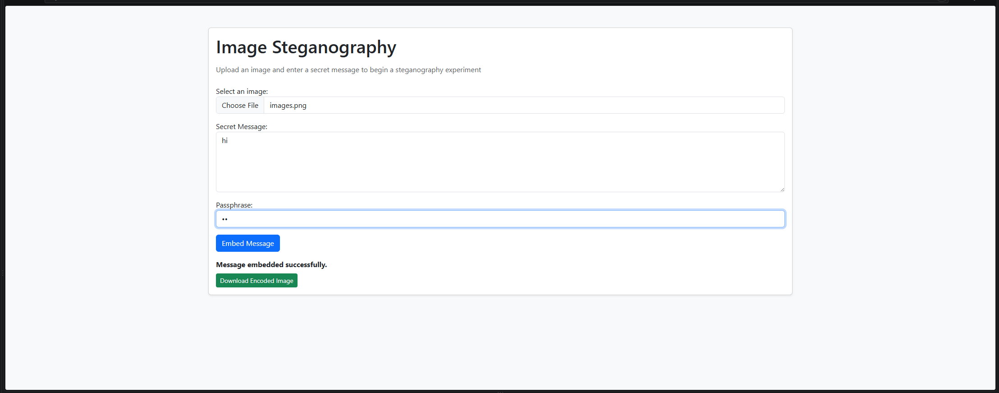

# Team 2 Week 4 Progress Report

## Comprehensive Web-Based Steganography Sandbox 

**Team:** Bryan Goodman, Kendra Pelzer, Jamaal Spratley
#
**Reporting period:** Week 4

## 1. Milestones achieved
- Successfully complete pytest and ensured no errors and all files passed and had no errors/warning messages. 
- Developed the initial frontend interface for the Image LSB steganography workflow.
- Successfully completed the first upload link between the frontend and backend.

## 2. Subtasks completed
| Subtask | Owner | Completed work |
| --- | --- | --- |
| Team Leader | Jamaal Spratley | ull-stack integration, REST API design, Git workflow, deployment, and release coordination. |
| Member A (Backend) | Bryan Goodman | steganography algorithms, encryption, service layer, and REST APIs. |
| Member B (Frontend/QA) | Kendra Pelzer | Bootstrap UI/UX, visualizations, Pytest suite, documentation, and accessibility checks. |

## 3. Test evidence

### 3.1 Image upload with Encryption

**Purpose:** Complete a pytest to ensure each script works without any syntax errors. Make sure each test pass without any warnings. 

**Expected result:** Pytest completed with any errors or warnings fixed. 

**Result:** PASS.

**Completed Pytest**

*Image 1: Completed pytest and ensured no errors/warnings*

#
### 3.2 Image Steganography Frontend Interface - Kendra

**Frontend Tests:** Four automated test cases were created to verify that submission with a missing image is rejected, submission with a missing secret message is rejected, submission with a missing passphrase is rejected, and valid image, message, and passphrase inputs successfully pass frontend validation.

**Expected result:** All required fields are validated.

**Result:** All four automated tests passed. Manual testing was also performed in the browser to verify the interface layout, required-field behavior, and successful validation status message.

*Image 2: Automated validation tests passed to include frontend interface*

#
### 3.3 Jamaal Part

**Purpose:** take the code from kendra and bryan and make them work tegther to upload an image and embed a message into the image with a key to later decrypt 

**Expected result:** the upload worked and the message is embedded.

**Result:** PASS.

*Image 3: * a image of the message being sucessfully encoded 

## 4. Lessons learned

- Using codespace became really convenient this week. Using codespace inside of the repository instead of using the VScode app was the best lesson learned. Definitely easier to merge and create pull requests.
- Ensuring naming is correct and matches within coding to ensure all files communicate properly. 
-  I learned how to translate frontend planning into a functional HTML interface using client-side form validation. I also gained hands-on experience using Pytest and Playwright for automated browser testing.
- png has multiple forms like RGB and RGBA.

## 5. Progress against the plan

The Week 4 plan required the team to complete pytests, develop the frontend UI, connect frontend and backend. and ensure uploading commenced smoothly while testing the encryption process.

The Week 5 focus will be to experiment metadata, error handling, integration fixes, and download flow.
