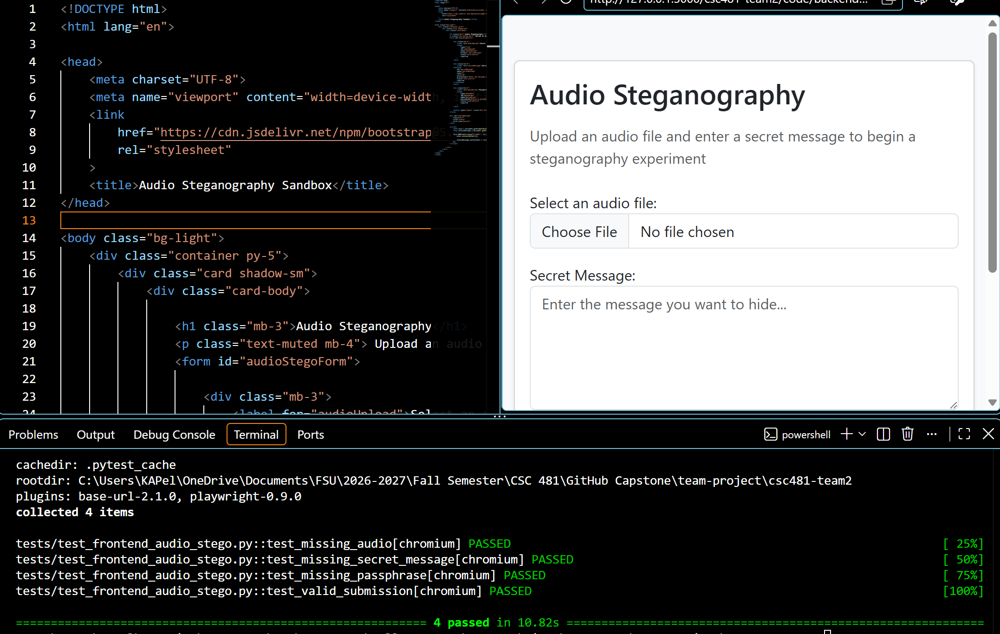

# Team 2 Week 5 Progress Report

## Comprehensive Web-Based Steganography Sandbox 

**Team:** Bryan Goodman, Kendra Pelzer, Jamaal Spratley
#
**Reporting period:** Week 5

## 1. Milestones achieved
- Ensured the PNG steganography was implemented and verified with the payload encoder.
- Completed pytest of steganography.py. All tests passed with no errors occurring. 
- Developed the initial frontend interface for the Audio LSB steganography workflow, including WAV file selection, client-side validation, and status feedback.
- 

## 2. Subtasks completed
| Subtask | Owner | Completed work |
| --- | --- | --- |
| Team Leader | Jamaal Spratley | ull-stack integration, REST API design, Git workflow, deployment, and release coordination. |
| Member A (Backend) | Bryan Goodman | steganography algorithms, encryption, service layer, and REST APIs. |
| Member B (Frontend/QA) | Kendra Pelzer | Audio LSB frontend interface development, WAV file selection, required input validation. |

## 3. Test evidence

### 3.1 Bryan

**Purpose:** Test the script steganography.py and ensure the PNG steganography payload encoder is implemented and verified. 

**Expected Result:** Testing of the steganography.py script with no errors and all tests passed during pytest. 

**Result:** Pytest completed on the script steganography.py. All tests passed and had no errors. 

**Completed Pytest**
*
*Image 1: Steganography.py pytest completion with all test passed*

#
### 3.2 Audio Steganography Frontend Interface - Kendra

**Frontend Tests:** Four automated test cases were created to verify that submission with a missing audio file is rejected, submission with a missing secret message is rejected, submission with a missing passphrase is rejected, and valid audio file, message, and passphrase inputs successfully pass frontend validation.

**Expected result:** Audio Steganography interface correctly validates all required inputs and provides status feedback.

**Result:** PASS. All four automated Pytest/Playwright tests passed. Manual browser testing also confirmed the interface layout, WAV file selection, required-field behavior, and successful validation status message.

*Image 2: Audio Steganography frontend interface with four automated validation tests passing*

#
### 3.3 Jamaal Part

**Purpose:**  

**Expected result:**

**Result:** 

*Image here*

*Image 3: Enter Description here*

## 4. Lessons learned

- Unit testing is very important. Testing one feature at a time makes it easier to find any issues that may occur, which is important to find before combining everything with the rest of the application. 
- I learned how to adapt an existing frontend component for a new steganography carrier while maintaining consistent validation and testing behavior. I also gained additional experience configuring and troubleshooting Pytest/Playwright tests within a new development environment.
- 

## 5. Progress against the plan

The Week 5 plan required the team to validate the PNG steganography service by creating and completing a  pytest which ensured the payload was embedded into a PNG image and recovered. Overall, the team wanted to verify that the encoder was working without errors before integrating it with other applications. 

The Week 6 focus will be to....
