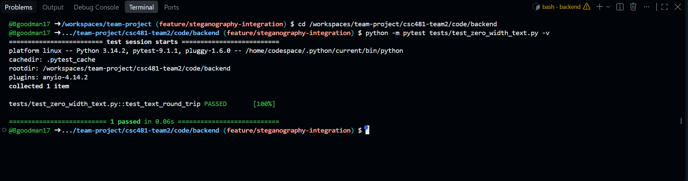
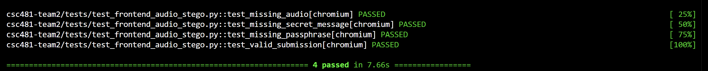
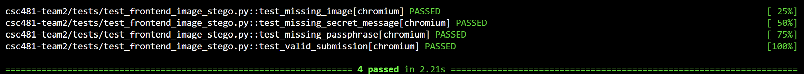
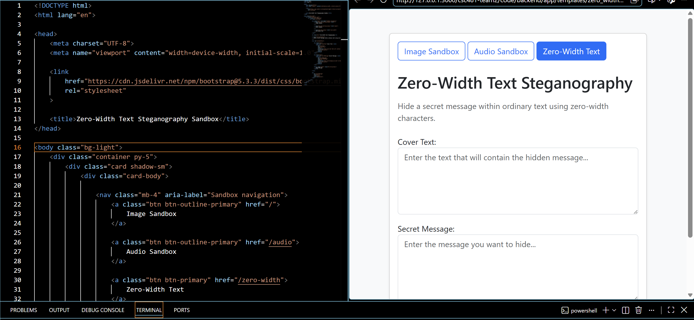

# Team 2 Week 6 Progress Report

## Comprehensive Web-Based Steganography Sandbox 

**Team:** Bryan Goodman, Kendra Pelzer, Jamaal Spratley
#
**Reporting period:** Week 6

## 1. Milestones achieved
- Completed and ensured pytest for the zero-width steganography. Testing contained no errors/warnings and passed 100%. 
- Updated and verified automated frontend test suites for the integrated image and audio steganography interfaces and developed the initial frontend interface for zero-width text steganography.
- Jamaal

## 2. Subtasks completed
| Subtask | Owner | Completed work |
| --- | --- | --- |
| Team Leader | Jamaal Spratley |  |
| Member A (Backend) | Bryan Goodman | Ensured the zero-width steganography communicates with the main branch. Complete Pytest for zero-width steganography and make sure there are no warnings. |
| Member B (Frontend/QA) | Kendra Pelzer | Updated image and audio frontend automated tests, verified all eight tests passed, and developed the initial zero-width text steganography HTML interface. |

## 3. Test evidence

### 3.1 Bryan

**Purpose:**
Complete a pytest to make sure the zero-width steganography runs with no warnings. Make certain the test passed 100%.

**Expected Result:**
Completion of the pytest with no errors/warnings. 

**Result:** 
Zero-Width pytest completed. 100% passed and contained no warnings or errors. 

**Completed Pytest**

*Image 1: Zero-Width pytest passed 100% with no warnings*

#
### 3.2 Frontend Integration Testing and Zero-Width Text Interface - Kendra

**Frontend Tests:**
Existing Pytest frontend tests were updated to support the current integrated image and audio steganography workflows.

**Expected result:**
Image and audio frontend interfaces correctly validate required inputs and successfully complete automated tests against the current integrated workflow.

**Result:** 
PASS. All four audio frontend tests and all four image frontend tests passed after the test suites were updated. An initial zero-width text steganography frontend interface was also developed with required Cover Text and Secret Message fields, an Embed Message button, and a status area for future backend integration.

*Image 2: Audio Steganography frontend automated testing with all four Pytests passing*

*Image 3: Image Steganography frontend automated testing with all four Pytests passing*

*Image 4: Initial Zero-Width Text Steganography frontend interface*

#
### 3.3 Jamaal

**Purpose:**

**Expected result:**

**Result:**

*insert image here*

*Image 5:*

## 4. Lessons learned

- I learned that passings pytests do not always require a pull request. Only the actual code changes, or test file changes need to be committed or pushed. Also, I gained more information on the zero-width steganography. Zero-width steganography can hide information in normal-looking text, which is why testing and ensuring data can be recovered is important. 
- I learned how frontend tests may need to be updated when application integration changes file locations and expected behavior. I also gained experience using mocked API responses to test frontend functionality independently of backend availability and reinforced the importance of using reliable file paths in automated tests.
- Jamaal

## 5. Progress against the plan

The Week 5 plan required...

The Week 7 will focus on...
