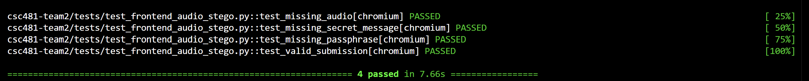
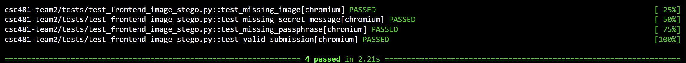
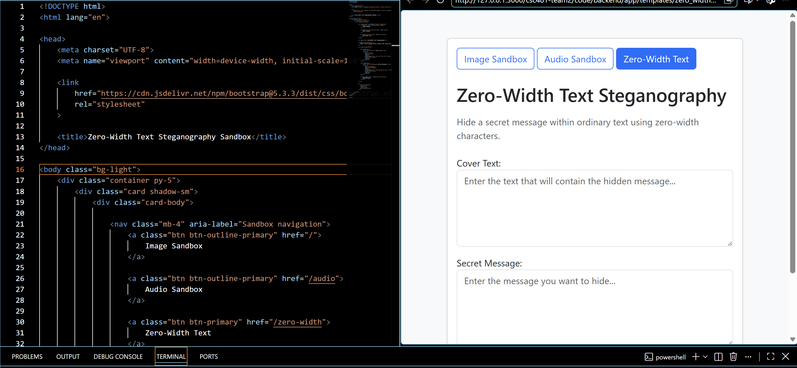
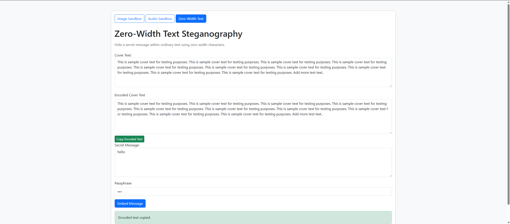

# Team 2 Week 7 Progress Report

## Comprehensive Web-Based Steganography Sandbox 

**Team:** Bryan Goodman, Kendra Pelzer, Jamaal Spratley
#
**Reporting period:** Week 7
## 1. Milestones achieved
- Edited scripts to ensure decryption process went smoothly. Completed pytest for zero-width to make sre processes are going smoothly with no errors or warnings. 

## 2. Subtasks completed
| Subtask | Owner | Completed work |
| --- | --- | --- |
| Team Leader | Jamaal Spratley | Implemented zero-width text into the app and ran the first test for encoding |
| Member A (Backend) | Bryan Goodman | Ensured the zero-width steganography communicates with the main branch. Completed Pytest for zero-width steganography and make sure there are no warnings. |
| Member B (Frontend/QA) | Kendra Pelzer | Updated image and audio frontend automated tests, verified all eight tests passed, and developed the initial zero-width text steganography HTML interface. |

## 3. Test evidence

### 3.1 Bryan

**Purpose:** Edit scripting to make sure import statements worked accordingly and communicated with each other and the main branch. After editing, completed a pytest for the zero-width and any warnings or errors were corrected. 

**Expected Result:** To have pytest completion of test_zero_width_text.py and zero_width_text.py

**Result:** Both pytest were completed and all warnings/errors were corrected to ensure import statements communicated. 

**Completed Pytest**

*Image 1: Completion of test_zero_width_text.py with no errors or warnings. 100% passed. 

*Image 2: Completion of zero_width_text.py with no errors or warnings. 100% passed. 

#
### 3.2 Frontend Integration Testing and Zero-Width Text Interface - Kendra

**Frontend Tests:**

**Expected result:**

**Result:** 

*Image 2: 

*Image 3: *

*Image 4: 

#
### 3.3 Jamaal

**Purpose:** 

**Expected result:**  

**Result:**  

*Image 5:* 

## 4. Lessons learned

- I learned that sometimes a simple change of an import statement can ensure communication with other processes within the main branch. After editing the import statements everything worked smoothly which was something I did not expect.
- Kendra
- Jamaal

## 5. Progress against the plan

The Week 7 the plan required pytest completion of test_zero_width_text.py and zero_width_text.py to ensure it communicates with the main branch. Both pytest passed 100% with no errors or warnings. KENDRA, JAMAAL PART

The Week 8 will focus on working towards the decryption of audio
