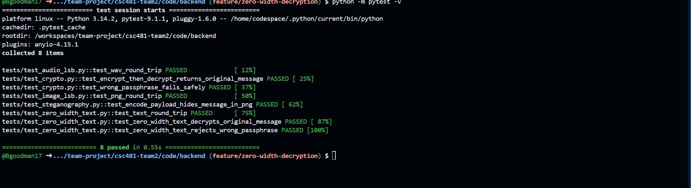

# Team 2 Week 7 Progress Report

## Comprehensive Web-Based Steganography Sandbox 

**Team:** Bryan Goodman, Kendra Pelzer, Jamaal Spratley
#
**Reporting period:** Week 7
## 1. Milestones achieved
- Edited scripts to ensure decryption process went smoothly. Completed pytest for zero-width to make sure processes are going smoothly with no errors or warnings.
- Developed the frontend interface for zero-width text decryption, including encoded-text input, passphrase input, message extraction controls, and a read-only decoded-message output field.
- zero-width implimentation is fully complete and working within the sandbox.

## 2. Subtasks completed
| Subtask | Owner | Completed work |
| --- | --- | --- |
| Team Leader | Jamaal Spratley | Implemented zero-width text into the app and ran the first test for encoding and now decoding |
| Member A (Backend) | Bryan Goodman | Ensured the zero-width steganography communicates with the main branch. Completed Pytest for zero-width steganography and make sure there are no warnings. |
| Member B (Frontend/QA) | Kendra Pelzer | Developed the zero-width decryption frontend interface and created automated frontend tests to validate required encoded-text and passphrase inputs and the read-only decoded-message output field. |

## 3. Test evidence

### 3.1 Bryan

**Purpose:** Edit scripting to make sure import statements worked accordingly and communicated with each other and the main branch. After editing, completed a pytest for the zero-width and any warnings or errors were corrected. 

**Expected Result:** To have pytest completion of test_zero_width_text.py and zero_width_text.py

**Result:** Both pytest were completed and all warnings/errors were corrected to ensure import statements communicated. 

**Completed Pytest**

*Image 1: Completion of test_zero_width_text.py with no errors or warnings. 100% passed. 

*Image 2: Completion of zero_width_text.py with no errors or warnings. 100% passed. 

#
### 3.2 Frontend Zero-Width Decryption - Kendra

**Frontend Tests:**
Validate the newly developed zero-width decryption frontend interface and ensure required user inputs and the decoded-message output field behave as expected.

**Expected result:**
The frontend should reject submissions when encoded text or the decryption passphrase is missing, and the decoded-message output field should be present and read-only.

**Result:** 
PASS. All three automated frontend tests passed. The tests confirmed validation for missing encoded text, validation for a missing decryption passphrase, and that the decoded-message output field is present and read-only.

*Image 3: Zero-width text decryption frontend with encoded-text input, passphrase field, Extract Message button, and decoded-message output.d

#
### 3.3 Jamaal

**Purpose:** add decryption path to app.py so the zero-width text can be extracted.

**Expected result:**  sectret message should be importes and extrated 

**Result:**  secret message was extrated corretly 

## 4. Lessons learned

- I learned that sometimes a simple change of an import statement can ensure communication with other processes within the main branch. After editing the import statements everything worked smoothly, which was something I did not expect.
- I learned how to extend an existing integrated frontend without interfering with previously implemented functionality. I also learned the importance of using unique element IDs when multiple forms contain similar inputs and of targeting a specific form during automated testing when multiple submit buttons are present on the same page.
- zero-wdith text needs a certions text size for the payload so the longer the hiddin text the longer your nonhidded text has to be to avoid corruption.

## 5. Progress against the plan

The Week 7 the plan required pytest completion of test_zero_width_text.py and zero_width_text.py to ensure it communicates with the main branch. Both pytest passed 100% with no errors or warnings. The frontend decryption interface was developed with fields for encoded text and the required passphrase, an Extract Message button, and a read-only field for displaying the decoded message. all part of zero-width text are added and working with the frontend and backend and encryption and decryption are working and running. All progress for this week is within schedule and all members are working hard to stay on schedule.

The Week 8 will focus on working towards the decryption of audio
