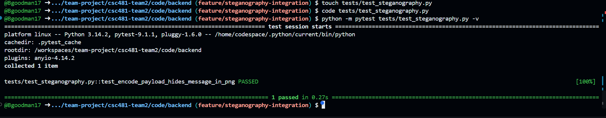
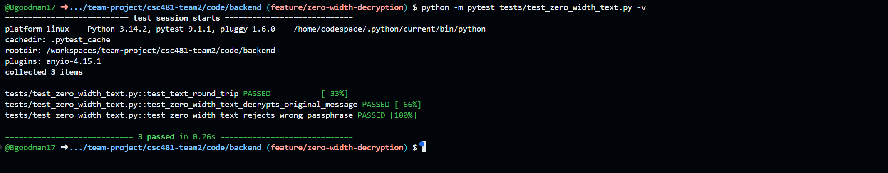

# TEAM 2 MIDTERM REPORT
## Project: Comprehensive Web-Based Steganography Sandbox

### Team Lead:
#### Team Member: Jamaal Spratley

### 1. Milestones Achieved

### 2. Completed Subtasks

### 3. Testing and Validation

### 4. Lessons Learned

### 5. Individual Contribution Summary

##
### Member A:
#### Team Member: Bryan Goodman

### 1. Milestones Achieved
The backend work progressed from project setup to tested encryption, image, audio, and zero-width-text steganography workflows. Each feature was validated with focused Pytest coverage before being integrated into the shared team repository.

- Backend structure and starter files: Created and organized the backend folders, service files, test files, dependency list, and backend design documentation needed for the project.
- Shared repository workflow: Created the feature/backend-starter branch and moved the backend foundation into the team repository so the team could review, merge, and use the work.
- Core encryption support: Established encryption and decryption functionality with passphrase validation so protected payloads can be recovered only with the correct passphrase.
- Image steganography: Implemented and verified PNG payload encoding through the steganography service and its automated test coverage.
- Audio steganography: Verified the WAV carrier workflow, including successful message recovery and safe handling of an incorrect passphrase.
- Zero-width text steganography: Completed embedding and decryption support for hidden text messages, including recovery of the original message and rejection of an incorrect passphrase.
- Backend regression testing: Resolved service import issues and confirmed the full backend test suite passed with ten automated tests.

### 2. Completed Subtasks

### Backend Planning and Repository Setup

Prepared the backend foundation for the capstone project. This work included creating the application and service folders, creating starter modules for encryption and steganography features, adding test files, defining required Python packages, and documenting the proposed backend design. The work was placed on a feature branch and moved into the shared repository for team collaboration. 

### Encryption Service Development

Implemented the encryption workflow used by the steganography services. The tests verify that a message encrypted with a passphrase can be decrypted back to its original value and that an incorrect passphrase fails safely.

### Image Steganography Development

Implemented and tested the PNG payload encoder. The service hides a binary payload in the least significant bits of a PNG image, allowing the application to store encrypted information while preserving a usable image file.

### Audio Steganography Development

Maintained and tested the WAV audio carrier workflow. The tests cover the basic audio round trip as well as decryption of the original message and safe rejection of an incorrect passphrase.

### Zero Width Text Steganography Development

Completed testing for the zero-width text carrier and added decryption support. The workflow embeds encrypted payload data in ordinary-looking cover text, extracts the encrypted payload, decrypts it with the provided passphrase, and returns the original message.

### Test Suite Maintenance and Integration

Updated service imports in the backend tests to match the application structure. This resolved module-loading issues and allowed the complete backend suite to run successfully after the zero-width and audio decryption work was added.

### 3. Testing and Validation

#### Image Steganography Backend
Purpose: Verify that the PNG steganography service can encode a payload into a supported image file.

Test cases: 
- Run the image payload encoder test.
- Confirm the service hides the payload in the PNG without test failures.

Result: The PNG payload encoder test passed.

Evidence: *
*Image 1: Steganography.py pytest completion with all test passed*

#### Zero Width Text Decryption
Purpose: Verify that the zero-width text service can recover the original encrypted message and handle an invalid passphrase safely.

Test cases: 
- Embed an encrypted payload into ordinary cover text.
- Extract and decrypt the hidden text using the correct passphrase.
- Confirm an incorrect passphrase raises the expected error rather than returning a message.

Result: Three zero-width tests passed: base text round trip, correct-passphrase decryption, and wrong-passphrase rejection.

Evidence: Pytest screenshots: 

*Image 1: Completion of test_zero_width_text.py with no errors or warnings. 100% passed. 

*Image 2: Completion of zero_width_text.py with no errors or warnings. 100% passed. 

#### Audio Steganography Decryption
Purpose: Verify that the WAV audio workflow recovers the original message and rejects an incorrect passphrase safely.

Test cases: 
- Confirm the audio carrier completes a basic WAV round trip.
- Confirm the audio decrypt workflow returns the original message with the correct passphrase.
- Confirm the audio decrypt workflow rejects an incorrect passphrase.

Result: All three audio tests passed as part of the complete backend suite.

Evidence: Verified in the full backend Pytest run.

#### Full Backend Regression Suite
Purpose: Verify that all backend services and tests work together after import and integration changes.

Test cases: 
- Run the complete Pytest suite from the backend directory.
- Confirm encryption, image, audio, steganography, and zero-width tests are collected and pass.

Result: All ten automated backend tests passed.

Evidence: Full-suite evidence: 10 passed in 0.84 seconds.

### 4. Lessons Learned

- Focused unit tests make it easier to isolate a problem before combining a feature with the rest of the application.
- Correct import paths are essential for communication between backend services; a small import change can prevent an entire test suite from loading.
- A passing Pytest run is verification evidence, but only source-code or test-file changes need to be committed, pushed, and submitted in a pull request.
- GitHub Codespaces keeps the test environment close to the shared repository, which simplifies collaboration, commits, pushes, and pull requests.

### 5. Individual Contribution Summary
As Member A, I developed and tested the project’s backend services. I organized the backend files, implemented encryption, image, audio, and zero-width text steganography features, and added decryption support for audio and zero-width text. I also maintained the Pytest suite, fixed service import issues, and verified that all ten backend tests passed. I used GitHub Codespaces, feature branches, commits, and pull requests to add my work to the shared team repository.

##
### Member B: Frontend Development & Quality Assurance
#### Team Member: Kendra Pelzer

### 1. Milestones Achieved

The frontend development and quality assurance portion of the project has progressed from initial planning and design to functional interfaces for image, audio, and zero-width text steganography.

The following milestones have been achieved:

-	Frontend Planning & Design: Established the initial user workflow, accessibility requirements, low-fidelity wireframes, QA checklist, and anticipated frontend API requirements.
-	Image Steganography Interface: Developed the initial Image LSB frontend interface with required input validation, user feedback, and automated browser tests.
-	Audio Steganography Interface: Developed the Audio LSB frontend interface with WAV file selection, input validation, and status feedback.
-	Frontend Integration Testing: Updated the existing image and audio automated test suites to accommodate changes introduced during application integration.
-	Zero-Width Text Interface: Developed the initial zero-width text embedding interface, including cover-text and secret-message fields.
-	Zero-Width Decryption Interface: Extended the zero-width frontend to support encoded-text-input, passphrase entry, message extraction, and read-only decoded-message output.

### 2. Completed Subtasks
#### Frontend Planning & Documentation

Developed initial design documentation outlining the application’s proposed user workflow, accessibility requirements, interface structure, and anticipated backend interactions. This includes requirements for experiment submission, job-status tracking, results retrieval, downloads, and error handling.

#### Image LSB Frontend Development

Created the initial image steganography interface with input fields for an image file, secret message, and passphrase. Implemented frontend validation to prevent incomplete submissions and provide appropriate status feedback.

#### Audio LSB Frontend Development

Developed the audio steganography interface to support WAV file selection, secret message entry, and passphrase validation. Maintained consistent interface behavior with the existing image workflow.

#### Frontend Integration and Test Maintenance

Updated the automated test following application integration changes. Adjustments accounted for updated file locations and expected frontend behavior, including the use of mocked API responses where appropriate.

#### Zero-Width Text Frontend Development

Created the initial zero-width text embedding interface with fields for cover text, secret message, an “Embed Message” button, and status area. Extended the interface to include decryption functionality, allowing users to enter encoded text and a passphrase, initiate extraction, and view the decoded message in a read-only output field.

### 3. Testing and Validation

#### Image Steganography Frontend

Purpose: Verify that the image frontend correctly validates the required inputs.

Test Cases:
- Reject submission when the image file is missing.
-	Reject submission when the secret message is missing.
-	Reject submission when the passphrase is missing.
-	Accept valid image, message, and passphrase inputs through frontend validation.

Result: All four automated Pytests passed. Manual browser testing confirmed the interface layout, required field behavior, and validation status feedback.

Evidence: *insert screenshots here*

#### Audio Steganography Frontend
Purpose: Verify that the audio interface correctly handles required inputs and provides validation feedback.

Test Cases:
-	Reject submission when the WAV file is missing.
-	Reject submission when the secret message is missing.
-	Reject submission when the passphrase is missing.
-	Accept valid WAV file, message, and passphrase inputs through frontend validation.
Result: All four automated Pytests passed. Manual browser testing confirmed the WAV file selection, required field validation, and successful status feedback.

Evidence: *insert screenshots here*

#### Image and Audio Integration Testing
Purpose: Verify that the existing frontend tests remain functional following integration changes.

Method: Update the automated tests to reflect the current application structure, file paths, and expected behavior. Mocked API responses were used where necessary to test frontend behavior independently.

Result: All eight automated tests passed, consisting of four image tests and four audio tests.

Evidence: *insert screenshots here*

#####  Zero-Width Text Decryption Frontend
Purpose: Verify that the zero-width decryption interface validates required inputs and displays the decoded message output field properly.

Test Cases:
-	Reject submission when the encoded text is missing.
-	Reject submissions when the decryption passphrase is missing.
-	Verify that the decoded message output field exists and is read-only.

Result: All three automated Pytests passed. Manual browser testing confirmed implementation of the zero-width interface, required field validation, and successful status feedback.

Evidence: *insert screenshots here*

### 4. Lessons Learned

Throughout frontend development and testing, I gained additional experience translating design requirements into functional HTML interfaces and implementing client-side validation. I also improved my understanding of Git Hub workflows, including branches, commits, pushes, and pull requests. Automated testing reinforced the importance of validating individual components before and after integration. Changes to application structure can require updates to test paths, selectors, and expected behavior. Additionally, extending the zero-width interface demonstrated the importance of using HTML element IDs and accurately targeting forms when multiple inputs and submit buttons exist on the same page.

### 5. Individual Contribution Summary

As Member B, I have contributed to frontend planning, interface development, input validation, automated testing, integration-related test maintenance, and project documentation. My completed work includes frontend interfaces for all three supported steganography carriers, zero-width text decryption controls, and automated tests validating the expected behavior of these interfaces. These contributions are documented through the weekly progress reports, test screenshots, and associated GitHub submissions.

##
### Progress Against the Project Plan
The backend plan called for a reusable service layer for encryption and multiple steganography carriers, supported by automated tests. The completed work meets that direction: the project has working image, audio, and zero-width text workflows; encryption and decryption coverage; and a full backend regression suite that passed after integration fixes. The next backend focus should be to keep the service interfaces stable as the frontend connects to them and to add end-to-end tests for the complete user workflow.
